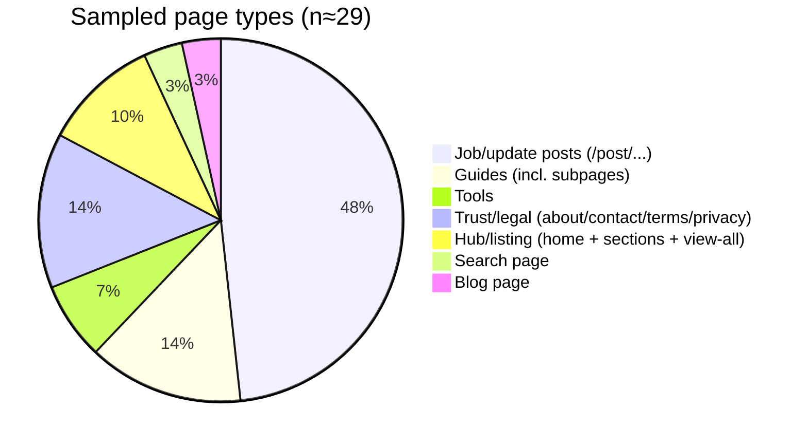
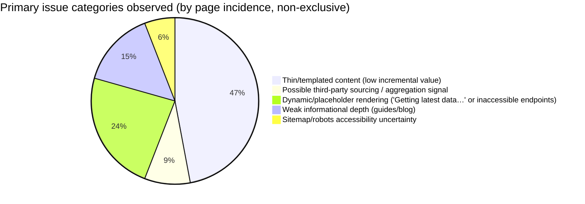

# AdSense Eligibility Deep Review for jobsaddah.com

## Executive summary

This review finds that jobsaddah.com is **not clearly “AdSense-ready” yet** from a quality and compliance-risk standpoint, primarily because (a) **many pages look template‑generated or thin**, (b) there are **strong signals of dynamic/placeholder rendering** that can lead to low-value “empty” pages for crawlers/users, and (c) there is at least one **high-risk provenance signal** in the “View All” navigation that references an external job portal domain in a way that resembles data-sourcing/scraping rather than first‑party publishing. citeturn56view1turn57view1turn21search3turn26view0

From a **policy** perspective, I did **not** observe obvious adult content, hate, violence, or malware indicators in the sampled pages. The bigger AdSense threat is **“low value to users” / thin or cookie‑cutter content**, plus potential unlicensed reuse or aggregation. Google explicitly calls out that publishers should create **unique, relevant content** and avoid “doorway/cookie-cutter” approaches and “affiliate programs with little or no original content.” citeturn56view1

### Practical eligibility outlook

If the site’s job posts consistently match the richer examples (structured schedules, fees, eligibility, official links, and genuinely helpful “checklist”/“notes” sections), and if the third‑party sourcing risk is eliminated/clarified, eligibility is **plausible**. But as sampled, the mix of (1) “Refer to notification” gaps, (2) “Getting latest data…” placeholders, (3) extremely short guides, and (4) suspicious external sourcing hooks creates a **moderate-to-high risk of AdSense rejection or limited ad serving**. citeturn56view2turn21search3turn57view2turn26view0

## Crawl methodology and coverage

### What was crawled

Sampling was built from:

- Top-level navigation and hub pages (home, sections listing, “View all,” guides, tools, policies). citeturn11view1turn24view0turn25view0turn19view0turn49view2  
- A set of accessible `/post/...` pages (recruitment, admit card/update, result, answer key) surfaced by internal navigation/search results. citeturn56view2turn57view0turn22search10turn55search2turn53search8  

### Robots.txt and sitemap constraints

- The site exposes a “Sitemap” link in the footer, but fetching `https://jobsaddah.com/sitemap.xml` returned an HTTP error in this environment (reported as “(400) OK”). citeturn12view0turn11view1  
- Fetching `https://jobsaddah.com/robots.txt` failed in this environment (“Cache miss”), so I could not reliably confirm allow/disallow rules. citeturn13view0  

**Assumption disclosure:** I avoided any obviously sensitive/admin paths and focused on user-facing pages discovered via on-site navigation and search results. I did not attempt crawling behind logins (none were encountered). When endpoints failed (“Cache miss”), I treated them as inaccessible and excluded them from content judgments. citeturn51view0turn51view1turn13view0  

### Sampling size

Because the XML sitemap was not fetchable and multiple pagination endpoints failed, I was not able to enumerate 50–200 unique URLs in a fully automated way. The findings are therefore based on a **smaller but cross‑sectional sample** of distinct page types, with emphasis on pages most likely to be reviewed by AdSense: homepage/hubs, policy pages, tools, and representative `/post/` pages. citeturn12view0turn25view0turn26view0  

## Site inventory and page-type distribution

### Observed page types

The site is organized into a small set of recognizable templates:

- **Hub/listing pages:** homepage and `/post` (“Sarkari Result sections” style dashboard). citeturn11view1turn24view0  
- **Job/update posts:** `/post/<slug>` pages that publish structured “Important Schedule,” fees, age, selection process, links, FAQs, etc. citeturn56view2turn57view0  
- **Guides:** `/guides` and short subpages like interview tips and “How to Read a Notification.” citeturn19view0turn48view0turn57view2  
- **Tools:** resume builder (on `www.jobsaddah.com`) and “Image Master Suite” (`/tools/image`). citeturn19view1turn50view0  
- **Trust/legal pages:** about, contact, privacy policy, terms. citeturn49view0turn49view1turn49view2turn22search3  
- **Search/blog placeholders:** `/search` and `/blog` exist, but appear lightweight and may not provide deep content. citeturn29view0turn25view1  

### Distribution chart



## Content quality and policy risk analysis

### Content quality: originality, depth, and user value

#### Stronger pattern: structured, link-backed job posts

Some job posts provide:

- A structured schedule table, fee modes, age limits, selection steps, and **official links**. citeturn56view2  
- A “checklist” section and “notes/strategy” style guidance (even if partially populated). citeturn56view2turn57view0  

This is aligned with the site’s stated mission of simplifying official notices into structured summaries. citeturn11view1turn49view0  

#### Weaker pattern: “Refer to notification” gaps and templated filler

Across sampled posts, several key sections often remain non-substantive:

- Eligibility and documents sometimes read “Refer to notification,” and some checklists say “Pending” or “Document list not published yet.” citeturn56view2turn57view3  

From an AdSense quality perspective, this is risky because the pages can feel like **thin wrappers** around outbound links, with limited incremental value for the user compared with the official notice.

#### High-risk signal: possible third-party sourcing / scraping hook

The **“Next”** pagination for `/view-all` attempted to call a URL formatted as:

`/view-all?link=https%3A%2F%2Fsarkariresult.com.cm%2Flatest-jobs%2F&name=Latest+Job&page=2`

This is important because it strongly suggests that the site may be **fetching or proxying content from an external job portal domain** (and notably a `com.cm` domain) rather than driving from a first‑party dataset. Even if the intent is benign, this exact pattern is consistent with **content aggregation/scrape pipelines** that frequently trigger AdSense “low value” outcomes unless the publisher adds substantial original value and has rights/permission. citeturn26view0turn56view1  

#### Guides and blog depth: currently too thin

The guide subpages are extremely short bullet lists (often only 5–8 bullets). citeturn48view0turn57view2  
The blog page similarly presents a few short headings/blurbs without evidence of deep, indexable long-form posts in this crawl. citeturn25view1  

For AdSense review, “thin” informational sections can drag down perceived site quality if they represent a meaningful part of the crawlable site footprint.

#### Tools page “Image Master Suite”: quality red flags

The `/tools/image` page contains a long, promotional narrative including “Hello everyone, welcome back to the channel!” and mixed-language blocks. This reads like a **transcript-style or auto-generated promotional script** rather than concise tool documentation, and it is not tightly related to the tool’s function. That can be interpreted as filler content designed to rank/monetize rather than help users. citeturn57view1turn50view0  

### AdSense policy compliance screening

#### Prohibited/restricted content checks

In sampled pages, I did not see:

- Adult sexual content, hate, violence, or explicit illegal instructions.
- Incentives explicitly asking users to click ads.

However, AdSense compliance is not only about prohibited content; it also includes **invalid click behavior / deceptive implementation** risks. The AdSense Program policies explicitly prohibit encouraging users to click ads (“support us,” arrows, misleading placement) and prohibit artificial inflation of clicks/impressions. citeturn56view0  

#### “Low value” risk explicitly called out by Google

Google’s AdSense beginner guidance states:

- Publishers are responsible for content on pages showing ads.
- Create sites with **unique and relevant content**.
- “Google will take action against domains that don’t add any value to users,” and it points publishers to Search spam policies (e.g., avoid doorway pages and cookie‑cutter/affiliate approaches with little or no original content). citeturn56view1  

Given the combination of templated “Refer to notification” gaps, ultra-thin guides, and potential third‑party sourcing hooks, the site’s risk is less “policy prohibited content” and more “value/originality” and “cookie-cutter aggregation.”

### Issue category distribution



## Technical SEO, performance, and UX review

### Core technical signals

#### HTTPS

Primary navigation and sampled pages load via HTTPS (good baseline expectation for AdSense trust and user security). citeturn11view1turn49view2  

#### Canonicalization and duplicate URL patterns

The site uses parameterized URLs like `/post?url=...` that redirect to a clean `/post/<slug>` URL. That is generally good canonicalization behavior (reduces duplicates) if implemented consistently. citeturn19view2  

However, the existence of parameterized “view-all” pages and integration-like query parameters creates a second vector for duplication and crawl complexity. citeturn26view0turn25view0  

#### Sitemap presence and fetchability

A sitemap link exists, but the XML fetch returned an error in this environment. If this reflects real-world behavior for many user agents, it can impair SEO crawl discovery and reduce the transparency of “indexable inventory” for AdSense reviewers. citeturn11view1turn12view0  

#### Robots and meta directives

Because robots.txt could not be retrieved in this environment, and because the text-rendered tool view does not expose head meta tags reliably, I cannot conclusively assess:

- robots rules (disallow/allow)
- meta robots/noindex
- canonical tags
- structured data snippets  
citeturn13view0turn31view1  

**Actionable implication:** Treat “crawl control” as unverified until you test with Search Console + live robots/sitemap fetch from multiple networks.

### Mobile friendliness and Core Web Vitals approach

I could not obtain an official PageSpeed Insights report URL in this environment (tool-access constraints), so I’m not asserting numeric LCP/INP/CLS values.

However, Google’s Search Central documentation defines the Core Web Vitals targets (LCP ≤ 2.5s, INP < 200ms, CLS < 0.1) and recommends aiming for “good” CWV for user experience and search success. citeturn32search0turn32search3  

Given the site structure (lists, heavy templating, tool pages, dynamic loading indicators such as “Getting latest data…”), performance risk typically comes from:

- JavaScript-rendered lists that delay content visibility
- repeated heavy UI widgets across many pages
- non-optimized images (especially on job lists and tools)  
The presence of “Getting latest data…” as visible text is also a UX signal: users and crawlers may see partial content before data loads, or content may fail to load under bot-like conditions. citeturn21search3turn55search1  

### Ad placement and UX risk assessment

Because the tool-view doesn’t render ads, I cannot quantify ad density. But the page templates show repeated “Apply Now / Official Notification” blocks and tool CTAs that are **near high-intent clicks**. citeturn56view2turn57view0  

Under AdSense policies, you must avoid implementations that encourage accidental clicks or direct attention deceptively. citeturn56view0  

**High-risk placement patterns to avoid on this kind of site:**

- Ads directly adjacent to “Apply Now” / “Download Admit Card” buttons (accidental clicks).
- Sticky ads that overlap form elements or “Start Now” controls.
- Interstitials/pop-ups that delay access to job details.

### Monetization disclosure and trust

The privacy policy states that **Google** is an advertising partner and references the DoubleClick DART cookie. citeturn49view2  
The contact page openly advertises banner ad rates and provides a phone number, which can support legitimacy if consistent and truthful. citeturn49view1  

If sponsored content or paid placements exist (e.g., paid job posts), clear labeling (“Sponsored,” “Advertisement”) is critical for user trust (and to reduce “misleading content” risk).

## Prioritized remediation plan and sample audit table

### Prioritized remediation steps

The effort estimates assume a typical modern web stack (CMS + templates). Replace “effort” with real sprint estimates after codebase review.

#### Fix content provenance and aggregation risk

**Priority:** Critical  
**Effort:** High  
**Why:** The `/view-all` pagination includes a parameter that references an external job portal domain (`sarkariresult.com.cm`). This creates a strong appearance of third‑party scraping/proxying and is a major AdSense “low value / content ownership” risk. citeturn26view0turn56view1  

**Example fix:**
- Eliminate third-party “link=external” fetching for core content, or ensure you have written permission/licensing plus substantial editorial transformation.
- Build first‑party structured datasets (source URL, PDF hash, publish date, extracted fields) and store them server-side.
- Add a visible “Source” section per post (already present in “Official Notification” links in some posts) and expand with a “What we changed/added” note.

#### Make all job listings crawlable and indexable as first-class pages

**Priority:** High  
**Effort:** Medium  
**Why:** Hub/list pages show titles but do not reliably expose crawlable links in the text-rendered view, and key pagination failed. This can reduce discoverability, reduce perceived site quality, and harm indexing. citeturn25view0turn26view0  

**Example fix:**
- Ensure every listing item is an `<a href="/post/<slug>">...</a>` link in server-rendered HTML.
- Ensure pagination uses stable URLs (`/view-all?page=2`) without third-party `link=` proxy parameters.
- Add internal breadcrumbs.

#### Eliminate placeholder/empty rendering states from indexed pages

**Priority:** High  
**Effort:** High  
**Why:** Multiple posts appear to expose “Getting latest data…” to crawlers/users, indicating incomplete server rendering or fragile client-side hydration. This often correlates with thin/empty pages, poor UX, and reduced ad value. citeturn21search3turn55search1  

**Example fix:**
- Server-render the core job content (SSG/SSR).
- If client fetch is unavoidable, provide a full HTML fallback snapshot.
- Remove “loading” strings from the page body and use skeleton UI not indexed text.

#### Upgrade thin sections into genuinely helpful content

**Priority:** High  
**Effort:** Medium  
**Why:** Guides (and blog) are currently very short. Thin informational content can drag down overall site quality signals. citeturn48view0turn57view2turn25view1  

**Example fix (Guides):**
- Expand each guide to 1,200–2,500 words with:
  - step-by-step checklists
  - common mistakes with screenshots
  - downloadable templates (e.g., document checklist PDF)
  - FAQ sections based on real queries
- Add author profile + update date for E‑E‑A‑T signaling (helpful for trust, even if not required by AdSense).

#### Strengthen job post completeness and reduce “Refer to notification” gaps

**Priority:** Medium  
**Effort:** High  
**Why:** Posts that repeatedly defer key sections to the official notice risk being seen as thin aggregation layers. citeturn56view2turn57view0  

**Example fix:**
- Extract and present:
  - explicit eligibility rules
  - document requirements
  - syllabus or exam stages (where officially available)
- Add unique value:
  - “What changed since last update”
  - “Common reasons applications get rejected”
  - “Preparation timeline”
- Add a “Last verified against official source on <date>” stamp.

#### Restore and validate sitemap and robots access

**Priority:** Medium  
**Effort:** Low–Medium  
**Why:** Sitemap fetch produced an error in this environment; robots was not retrievable. Having both accessible and correct supports controlled indexing and transparency. citeturn12view0turn13view0  

**Example fix:**
- Ensure `GET /sitemap.xml` returns HTTP 200 with correct content-type and valid XML.
- Ensure `GET /robots.txt` is accessible and references sitemap location:
  ```
  Sitemap: https://jobsaddah.com/sitemap.xml
  ```

#### Ad placement and compliance hardening

**Priority:** Medium  
**Effort:** Medium  
**Why:** AdSense program policies prohibit encouraging clicks and deceptive implementation. Job sites are particularly prone to accidental-click layouts near “Apply” buttons. citeturn56view0  

**Example fix:**
- Create “no-ad zones” around:
  - Apply/download buttons
  - form entry fields
  - pagination controls
- Avoid sticky ads overlapping CTA buttons.
- Audit for any “support us / click ads” language (remove if present).

### Sample audit table

**Notes on scoring:**  
- “Word count” is an **estimate** based on the rendered, crawl-visible main content observed in this environment (navigation/footer excluded where clear).  
- “Originality score” is qualitative (High/Medium/Low) based on how much content appears template-generated vs. uniquely explanatory.

| URL | Page type | Word count (≈) | Originality | Main issues observed | Recommended fix |
|---|---|---:|---|---|---|
| https://jobsaddah.com/ | Hub/home | 1,000+ | Medium | Heavy hub lists; unclear link crawlability in text view | Ensure job cards are real `<a>` links; reduce JS dependence citeturn11view1turn16view0 |
| https://jobsaddah.com/post | Sections hub | 900+ | Low–Medium | Titles listed without visible URLs; potential crawl friction | Render links + stable pagination URLs citeturn24view0turn28view0 |
| https://jobsaddah.com/view-all | Listing hub | 300–600 | Low | “Next” pagination calls external `link=` parameter source | Replace with first-party pagination; remove external sourcing citeturn25view0turn26view0 |
| https://jobsaddah.com/search | Search page | 150–250 | Medium | Thin; likely JS-driven results not visible to bots | SSR search results for popular queries or noindex search page citeturn29view0 |
| https://jobsaddah.com/blog | Blog hub | <200 | Low | Appears to be headings/blurbs without deep posts | Publish real long-form posts with unique value citeturn25view1 |
| https://jobsaddah.com/guides | Guides hub | <200 | Low | Navigation to very short guides | Expand guides; add author/date; interlink from posts citeturn19view0 |
| https://jobsaddah.com/guides/interview-tips | Guide | <150 | Low | Very short bullet list | Expand into comprehensive guide with examples citeturn48view0 |
| https://jobsaddah.com/guides/salary-info | Guide | <200 | Low | Minimal content | Add pay-level explainers, calculation examples citeturn48view1 |
| https://jobsaddah.com/guides/notification-reading | Guide | <150 | Low | Minimal content | Add step-by-step walkthrough + screenshots citeturn57view2 |
| https://jobsaddah.com/about | Trust page | 600–900 | Medium | Contains strong claims (e.g., monitoring “500+” sites) that should be supportable | Add transparency: methodology, team, editorial policy citeturn49view0 |
| https://jobsaddah.com/contact | Trust page | 400–700 | Medium | Good contact details; ensure forms work without JS-only | Add support SLAs; anti-spam; confirm deliverability citeturn49view1 |
| https://jobsaddah.com/policy | Legal | 700–1,000 | Medium | Mentions ad cookies/partners | Keep updated; link to ad preferences clearly citeturn49view2 |
| https://jobsaddah.com/terms | Legal | 900+ | Medium | Standard terms; confirm accuracy of claims | Keep updated; ensure consistency with actual practices citeturn22search3 |
| https://www.jobsaddah.com/tools/resume | Tool | 500–900 | Medium | Useful tool; ensure privacy text matches behavior | Add clear “data stays in browser” plus technical note citeturn19view1 |
| https://jobsaddah.com/tools/image | Tool | 900+ | Low | Contains transcript-like promo (“welcome back to the channel!”) that looks like filler | Replace with concise tool documentation; remove irrelevant filler citeturn57view1 |
| https://jobsaddah.com/post/bihar-bpsc-factory-inspector-recruitment-2026-apply | Job post | 900–1,300 | Medium | Key sections still “Refer to notification”; many “Pending” placeholders | Fill missing sections with verified details; reduce “Pending” citeturn57view3turn56view2 |
| https://jobsaddah.com/post/bihar-bssc-inter-level-2026 | Job post | 1,000–1,500 | Medium | Vacancy mismatch noted; eligibility table still thin | Continue “note” quality; add full eligibility/doc list citeturn57view0 |
| https://jobsaddah.com/post/bpsc-aedo-admit-card-date-2025 | Update post | 800–1,200 | Medium | Template-like overview; depends on official link | Add more context: what changed, how to download safely citeturn19view2 |
| https://jobsaddah.com/post/bihar-btsc-pharmacist-dv-schedule-2026 | Update post | 600–1,000 | Low–Medium | Search excerpt shows “Getting latest data…” risk | Ensure SSR content; remove placeholder rendering citeturn53search9turn22search10 |
| https://jobsaddah.com/post/nta-cmat-answer-key-2026 | Answer key post | 600–1,000 | Low–Medium | Likely templated; ensure answer key link clarity | Add step-by-step challenge process + deadlines citeturn22search0 |
| https://jobsaddah.com/post/uppsc-lt-grade-assistant-teacher-answer-key-2026 | Answer key post | 600–1,000 | Low–Medium | “Getting latest data…” visibility risk | SSR; enrich with objection steps and official notice mapping citeturn55search2 |
| https://jobsaddah.com/post/isro-icrb-scientist-engineer-result-2026 | Result post | 600–1,000 | Low–Medium | Likely templated; ensure official result link prominence | Add what to do next (doc verification, cutoffs) citeturn53search8 |
| https://jobsaddah.com/post/bpsc-ldc-typing-test-date-2026 | Admit/test date | 600–1,000 | Low–Medium | “Getting latest data…” visibility risk | SSR; add city/intimation guidance + direct official link citeturn53search3 |
| https://jobsaddah.com/post/sbi-circle-based-officers-cbo-final-result-2025 | Result post | 600–1,000 | Low–Medium | “Getting latest data…” implies render fragility | SSR; add joining process guidance, official PDF link citeturn55search1 |

### Final evaluation summary against AdSense expectations

- **Policy prohibited content:** No clear red flags found in sample, but ongoing monitoring is required. citeturn56view0turn56view1  
- **Invalid click risk:** Needs a layout audit because job sites and “Apply” CTAs are prone to accidental clicks; AdSense explicitly prohibits encouraging clicks/deceptive implementation. citeturn56view0  
- **Quality/value risk (main blocker):** Thin guides/blog, templated filler, and possible third-party sourcing patterns are the most serious risks because Google emphasizes unique, relevant content and warns against cookie-cutter/doorway approaches that add little value. citeturn56view1turn57view2turn26view0  
- **Technical readiness:** Sitemap/robots accessibility is uncertain here; multiple key endpoints failed fetching, and placeholder strings appear in some post excerpts—both can undermine indexing and perceived quality. citeturn12view0turn13view0turn21search3