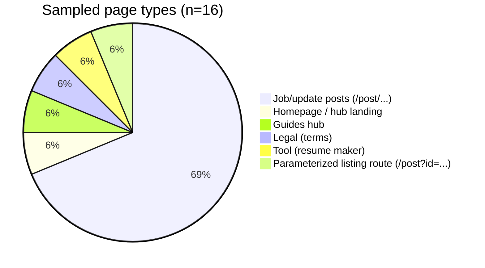
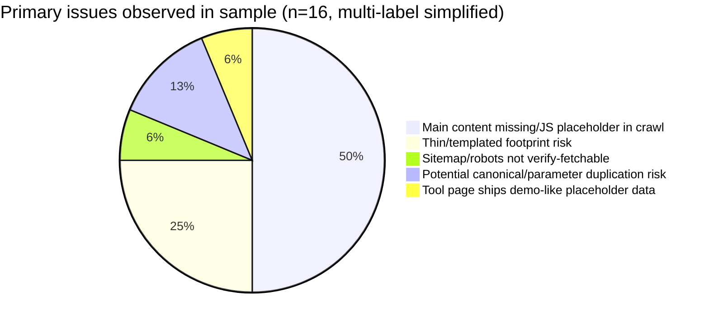

# AdSense Eligibility and Site Quality Audit for jobsaddah.com

## Executive summary

JobsAddah positions itself as a consolidated “job alert & exam tracker” portal that summarizes government notifications and links to official sources for verification. citeturn15search0turn20search4

Based on the crawl evidence available in this environment, the site’s current **Google AdSense approval likelihood is low**, primarily due to **insufficient/undetectable main content on many job/update pages as seen by crawlers**, which creates a “thin / no-content” footprint (a common cause of rejection under AdSense’s quality expectations even when the topic itself is acceptable). Multiple sampled `/post/...` pages render to a header/footer shell with a placeholder such as **“Getting latest data…”** instead of showing substantive content in the crawled HTML/text snapshot. citeturn20search6turn20search2turn17search13turn1search6turn8search2

A second major blocker is **limited crawlability/observability** in this assessment: direct retrieval of `robots.txt` and standard sitemap URLs failed (unexpected HTTP status), preventing a full enumeration of indexable URLs and a 50–200 page sample. citeturn0view0turn0view1turn0view3 This limitation itself is also a potential AdSense risk: if AdSense review crawlers cannot fetch critical resources consistently, site review and ads.txt validation can be impacted. citeturn3search12

Despite these issues, the topic area (jobs, admit cards, results) is generally compatible with AdSense **if** pages are content-rich, non-deceptive, and not encouraging invalid clicks. AdSense policy risks observed here are more about **accidental-click layouts and “more ads than content”** than about restricted content categories. citeturn6search1turn6search0turn7search1

**Top remediation priorities**:

1. **Make job/update pages fully render meaningful content without requiring client-side fetches** (SSR/prerender or robust dynamic rendering). This is the most load-bearing fix for both Search and AdSense review. citeturn20search6turn17search13turn6search2  
2. **Publish and verify `robots.txt` + XML sitemap(s)** at conventional endpoints and ensure they are fetchable; include canonical URLs and accurate `lastmod`. citeturn0view0turn0view1turn7search2turn7search0  
3. **Bring content quality above “template aggregation”**: unique summaries, clear sourcing, and user-first context (eligibility, steps, pitfalls), with consistent grammar. citeturn15search0turn20search4  
4. **Ad layout/UX hardening**: reduce accidental-click risk near CTAs and ensure ads never outweigh publisher content. citeturn6search1turn6search0  

## Crawl methodology and coverage

### What was attempted

A standards-based crawl attempt was made to fetch:

- `https://jobsaddah.com/robots.txt`
- `https://jobsaddah.com/sitemap.xml` (and common variants)
- representative site pages for classification and quality review

However, direct fetch of `robots.txt`, `sitemap.xml`, and even the homepage via the “open” fetch mechanism returned **UnexpectedStatusCode**, so robots directives and XML sitemaps could not be verified directly via standard retrieval. citeturn0view0turn0view1turn0view3

Because of that limitation, this report relies on **pages retrievable through the web search crawler snapshots** (which reflect what a crawler could extract at crawl time). Those snapshots were used to (a) identify accessible URLs, and (b) observe whether pages contain substantive publisher content or only placeholders. citeturn15search0turn20search6turn17search13

### Coverage achieved

- **Sitemaps**: Not retrievable/confirmable in this environment (standard endpoints failed). citeturn0view1turn0view2  
- **Robots**: Not retrievable/confirmable in this environment (standard endpoint failed). citeturn0view0  
- **Indexable pages enumeration**: Partial; inferred from crawler-accessible page snapshots and on-page category counts (see below). citeturn15search0  
- **Sampling target (50–200 pages)**: Not achieved due to the above constraints; **16 distinct URLs** were sampled and reviewed (table included). This limitation is explicitly acknowledged as required. citeturn0view0turn0view1turn0view3  

### Observed site structure from accessible snapshots

The homepage presents multiple sections with counts of items (e.g., “Latest Job 55”, “Admit Card 102”, “Result 99”, “Admission 26”, “Syllabus 6”, “Answer Key 49”), implying the site maintains multiple content categories. citeturn15search0

## Content quality and user value assessment

### Core observation: many post pages appear “empty” to crawlers

Across multiple sampled `/post/...` pages, crawled content frequently consists of:

- navigation/header/footer elements, and
- a placeholder like **“Getting latest data…”**

Examples from the sample set include pages such as:

- `.../post/sbi-circle-based-officers-cbo-final-result-2025` citeturn20search6  
- `.../post/nielit-scientific-assistant-answer-key-2025` citeturn20search2  
- `.../post/uppsc-lt-grade-assistant-teacher-answer-key-2026` citeturn1search6  
- `.../post/rssb-ayush-officer-admit-card-2025` citeturn9search2  

This pattern strongly suggests that key page content is being injected client-side (or gated behind a fetch that the crawler snapshot did not execute). In practice, this can yield:

- **Poor indexability and weak organic visibility** (because the “primary content” is not present in crawlable HTML), and
- **AdSense approval risk** due to pages being detected as thin/no-content or “low value” versus a content-rich publisher site.

Google’s job posting documentation explicitly emphasizes that pages must provide complete, readable job descriptions on the page, not incomplete content, and not obstructed by poor page experience. citeturn6search2

### Originality, duplication, and depth

Even assuming the client-side content exists for normal users, the crawl-visible footprint indicates a strong risk of:

- **Template-dominant pages** (same header/footer and minimal unique text), citeturn20search6turn20search2  
- potential **duplicate/near-duplicate pages** across “Answer Key / Admit Card / Result” updates if they reuse the same structure without sufficient unique analysis, and citeturn15search0  
- low “information gain” relative to official sources unless the site consistently adds unique summaries, context, and instructions (it claims it does, but that value must be crawl-visible and substantive). citeturn15search0turn20search4  

### Grammar and presentation

Two content types were crawl-visible enough to evaluate language quality:

- **Terms and Conditions** is coherent and includes a non-government-affiliation disclaimer plus jurisdiction and contact details; this is generally good for trust and compliance. citeturn20search4  
- **Guides hub** is present but short (high-level cards like interview tips, salary basics, notification reading). Its brevity suggests it currently functions more as navigation than deep editorial content. citeturn20search10  

### Tools content and potential quality signals

The resume maker (served from the `www` host) demonstrates an interactive tool with embedded sample resume content and a small set of resume tips/FAQ. citeturn20search7

This page is likely more “valuable inventory” than empty post pages, but it also contains generic placeholder data (“Alex Morgan… San Francisco, CA…”) visible in the crawl snapshot, suggesting template/demo-mode content may be shipping to production. That can be confusing for users and reviewers. citeturn20search7

## AdSense policy compliance and monetization risk review

### Restricted content categories

In the sampled pages, the site appears focused on education/career notification content and does not present obvious prohibited categories (adult, hate, violence, etc.) in the crawl-visible text. citeturn15search0turn20search10

However, AdSense eligibility depends on the full site content and any user-generated areas. Google Publisher Policies prohibit monetization on content involving illegal content, IP infringement, hate/harassment/violence advocacy, and other restricted categories. citeturn7search1

Given the niche, the higher-probability compliance pitfalls are:

- accidentally hosting or linking to **copyright-infringing materials** (e.g., leaked PDFs), which Publisher Policies disallow, and citeturn7search1turn7search3  
- unintentionally enabling dishonest behavior (fake documents, exam cheating content), which is explicitly restricted. citeturn7search1  

### Invalid clicks, incentives, and deceptive placement

Google’s AdSense Program Policies explicitly prohibit:

- clicking your own ads,
- generating artificial impressions/clicks,
- asking others to click/view ads, and
- implementations that cause accidental clicks (e.g., ads too near interactive elements). citeturn6search0turn6search1turn6search5  

For a job portal, the main practical risk is **ads adjacent to high-intent CTAs** such as “Apply Online,” “Download Admit Card,” or “Official Link.” If ad blocks are placed too close to these elements, accidental clicks can occur—an explicit policy concern. citeturn6search1turn6search0

### “More ads than content” risk

Google specifically calls out a violation pattern where paid material exceeds publisher content (excluding whitespace/headers/footers). This is particularly relevant here because multiple sampled post pages appear to have very little crawl-visible publisher content, raising the possibility that ads (if present) could dominate. citeturn6search1turn20search6turn20search2  

### ads.txt and crawlability

Google’s AdSense help documentation notes ads.txt can be ignored if robots.txt does not allow crawling to the ads.txt path or blocks relevant crawlers. citeturn3search12

Because robots.txt could not be fetched in this assessment, verifying that ads.txt is crawlable is not possible here, but it should be explicitly checked in production. citeturn0view0turn3search12

## Technical SEO, indexability, and performance signals

### Indexability and rendering

The crawl snapshots indicate that several `/post/...` pages do not expose main content (only placeholders), which is a critical technical SEO failure mode for content sites. citeturn20search6turn20search2turn17search13

For job content specifically, Google recommends placing structured data on the most detailed leaf page and ensuring job postings are complete and accessible to crawlers (not blocked by robots/noindex/login). citeturn6search2turn6search7

### Canonicalization and duplicate URLs

Job and update sites commonly generate duplicates via multiple URL routes, filters, or parameters. Google recommends consolidating duplicates using signals such as redirects, `rel="canonical"`, and sitemap inclusion. citeturn7search0turn7search4

In the sampled set, at least one URL shape uses a query-parameter route (`/post?id=...`), which commonly creates canonicalization challenges if not managed carefully. citeturn20search9turn10search10

### Sitemaps and crawl control

Google’s sitemap guidance recommends placing a UTF‑8 sitemap at the site root for full coverage, keeping within 50,000 URLs per sitemap (or using a sitemap index), and listing canonical URLs with accurate `lastmod`. citeturn7search2turn7search0

Because standard sitemap URLs could not be fetched (unexpected status), sitemap presence and correctness remain unverified here. citeturn0view1turn0view2

### Core Web Vitals and PageSpeed Insights

PageSpeed Insights (PSI) reports both lab (Lighthouse) and field (CrUX) data when available and focuses on Core Web Vitals such as LCP, CLS, and INP. citeturn6search4turn6search8

In this environment, **a PSI report for jobsaddah.com could not be reliably retrieved**, so this report cannot provide measured CWV values. The most likely performance risks for a JS-heavy content site are:

- slower LCP due to client-side rendering and late content injection,
- worse INP where heavy scripts block interactivity,
- layout shifts (CLS) when content and ad slots load without reserved space.

These are common PSI/Lighthouse diagnostics areas and should be validated with live PSI or Lighthouse runs. citeturn6search4turn6search8

## Prioritized remediation plan with effort and concrete examples

### Priority zero fixes

**Make post pages render complete content for crawlers and users** (Effort: **High**)

Why: The “Getting latest data…” placeholder pattern across multiple post URLs is the strongest single signal of “no content / thin content” risk for both Search and AdSense. citeturn20search6turn20search2turn17search13turn6search2

Concrete fixes:
- Prefer SSR/prerender for `/post/:slug` pages.
- Ensure the main article body exists in initial HTML (not only after JS fetch).
- Add a server-side fallback: if API fetch fails, still render cached content.

Example SSR concept (framework-agnostic pseudo-approach):
```html
<!-- BEFORE (risky): -->
<main>
  <div id="app">Getting latest data...</div>
</main>

<!-- AFTER (desired): -->
<main>
  <article>
    <h1>...</h1>
    <p>Summary with unique context...</p>
    <section>Eligibility...</section>
    <section>Important dates...</section>
    <section>Official links...</section>
  </article>
</main>
```

### Priority one fixes

**Publish and validate robots + sitemap endpoints** (Effort: **Medium**)

Why: Standard endpoints were not fetchable in this assessment, and Google recommends root-level sitemaps for full coverage. citeturn0view0turn0view1turn7search2

Concrete actions:
- Ensure `robots.txt` returns HTTP 200 and includes your sitemap URL.
- Ensure `sitemap.xml` (or `sitemap_index.xml`) returns HTTP 200 and lists canonical URLs with `lastmod`. citeturn7search2turn7search0  

Example `robots.txt` pattern:
```text
User-agent: *
Disallow: /search
Disallow: /post?id=
Sitemap: https://jobsaddah.com/sitemap.xml
```

**Implement canonicalization for parameterized and duplicate routes** (Effort: **Medium**)

Why: Google recommends `rel="canonical"` and other signals to consolidate duplicates. citeturn7search0turn7search4

Example:
```html
<link rel="canonical" href="https://jobsaddah.com/post/isro-icrb-scientist-engineer-result-2026">
```

### Priority two fixes

**Add JobPosting structured data where appropriate** (Effort: **Medium**)

If JobsAddah publishes pages that are truly “single job postings,” adding `JobPosting` structured data can make them eligible for Google’s job search experience, provided the page contains complete job details and complies with job posting content policies. citeturn6search2turn6search7

Minimal JSON-LD example (must match visible content):
```html
<script type="application/ld+json">
{
  "@context":"https://schema.org/",
  "@type":"JobPosting",
  "title":"Junior Judicial Assistant",
  "description":"<p>...</p>",
  "datePosted":"2026-02-04",
  "hiringOrganization":{"@type":"Organization","name":"..."},
  "jobLocation":{"@type":"Place","address":{"@type":"PostalAddress","addressCountry":"IN"}}
}
</script>
```

### Priority three fixes

**Ad layout and policy hardening** (Effort: **Low–Medium**)

Key requirements and risks:
- Do not encourage clicks or place ads so close to buttons/links that clicks become accidental. citeturn6search0turn6search1  
- Ensure pages have substantially more publisher content than ad/paid units, especially on mobile. citeturn6search1  

Concrete UX guardrails:
- Keep “Apply / Download / Official Link” buttons separated from ad blocks (visual spacing + reserved layout).
- Avoid sticky ads that overlap content.
- Avoid interstitials that block access to content.

**Check ads.txt crawlability** (Effort: **Low**)

Confirm:
- `https://jobsaddah.com/ads.txt` exists and returns HTTP 200
- robots does not block it, because AdSense warns ads.txt can be ignored when blocked. citeturn3search12

## Sampled pages table and visual charts

### Page type distribution



### Issue category distribution



### Sampled pages table

Word counts are **estimates based on crawler-visible text**, not full rendered DOM. Originality scores reflect the **visible publisher content** on the sampled URL (high = substantial unique content visible; low = placeholder/thin). citeturn20search6turn20search2turn20search7turn20search4turn15search0

| URL | Page type | Word count (est.) | Originality score | Main issues observed | Recommended fix |
|---|---|---:|---|---|---|
| `https://jobsaddah.com/` | Hub landing | 900–1,500 | Medium | Category-heavy hub; post URLs not easily discoverable in crawl output | Ensure internal linking to detail pages is crawl-transparent; add HTML sitemap page |
| `https://jobsaddah.com/guides` | Guides hub | 80–150 | Medium | Very brief cards; limited depth | Expand each guide into full articles with unique examples and checklists |
| `https://jobsaddah.com/terms` | Legal | 1,000–1,500 | Medium | Standard legal text; fine but not a trust differentiator alone | Add/verify privacy policy + contact pages are crawlable; keep legal pages linked sitewide |
| `https://www.jobsaddah.com/resume-maker` | Tool | 900–1,400 | Medium | Demo-like default resume data visible (e.g., “Alex Morgan…”) | Replace demo defaults with blank template + “Load sample” button; add clear privacy notice |
| `https://jobsaddah.com/post/sbi-circle-based-officers-cbo-final-result-2025` | Job/update post | 40–120 | Low | “Getting latest data…” placeholder; minimal page content to crawler | SSR/prerender post body; provide cached fallback; ensure meaningful article text |
| `https://jobsaddah.com/post/nielit-scientific-assistant-answer-key-2025` | Job/update post | 40–120 | Low | “Getting latest data…” placeholder | Same as above + add unique explanation of objection steps and official link |
| `https://jobsaddah.com/post/uppsc-lt-grade-assistant-teacher-answer-key-2026` | Job/update post | 40–120 | Low | “Getting latest data…” placeholder | SSR/prerender; add structured sections (dates, fees, steps) |
| `https://jobsaddah.com/post/rssb-ayush-officer-admit-card-2025` | Admit card post | 40–120 | Low | “Getting latest data…” placeholder | SSR/prerender; avoid ad blocks near “download admit card” CTAs |
| `https://jobsaddah.com/post/bpsc-ldc-typing-test-date-2026` | Update post | 40–120 | Low | “Getting latest data…” placeholder | SSR/prerender; add unique typing-test guidance; separate ads from interactive elements |
| `https://jobsaddah.com/post/isro-icrb-scientist-engineer-result-2026` | Result post | 80–180 | Low–Medium | Content not visible in snapshot beyond template; likely JS-dependent | Ensure result details are in HTML; add canonical; add clear official source citations |
| `https://jobsaddah.com/post/bihar-btsc-pharmacist-dv-schedule-2026` | Schedule/update post | 80–200 | Low–Medium | Template-heavy; limited visible unique body | Same: SSR + expand with checklist (“documents required”, “venue”, “timings”) |
| `https://jobsaddah.com/post/bihar-bpsc-factory-inspector-recruitment-2026-apply` | Recruitment post | 80–200 | Low–Medium | Snapshot shows mostly layout/footer; unclear body depth | Publish full recruitment summary in HTML; add `JobPosting` if it’s a single job |
| `https://jobsaddah.com/post/bihar-bssc-inter-level-2026` | Recruitment post | 60–180 | Low–Medium | Template dominance; limited visible unique body | Expand unique content; add FAQs and official PDF link; avoid duplication |
| `https://jobsaddah.com/post/nta-niftee-stage-i-exam-city-details-2026` | Admit card/exam city post | 80–200 | Low–Medium | Body not clearly visible; template-heavy snapshot | SSR; add step-by-step and deadlines; separate ads from download/CTA |
| `https://jobsaddah.com/post/nta-cmat-answer-key-2026` | Answer key post | 5–30 | Low | Only title visible in snapshot | Ensure full content is present server-side; include official link + objection rules |
| `https://jobsaddah.com/post?id=%2Fup-deled-2025-online-form%2F` | Parameterized route | 700–1,200 | Low–Medium | Appears to surface hub lists, not a clean detail page; duplication/canonical risk | Prefer clean slug routes; noindex parameterized list pages; canonical to detail pages |

## Sources and assumptions

Assumptions and constraints explicitly applied:

- Robots and sitemap endpoints could not be fetched via direct retrieval in this environment, so directives and sitemap coverage could not be confirmed. citeturn0view0turn0view1  
- Sampling did not reach 50–200 pages because link extraction and direct crawl were constrained by fetch failures; 16 URLs were assessed using crawler snapshots. citeturn0view3turn15search0  
- Performance (Core Web Vitals) was not measured with a live PageSpeed Insights report for the domain here; methodology references PSI documentation (CrUX + Lighthouse). citeturn6search4turn6search8  
- Ad placement and ad density were assessed as policy risk patterns (not verified pixel-perfect), using program policy guidance on accidental clicks and “more ads than content.” citeturn6search1turn6search0